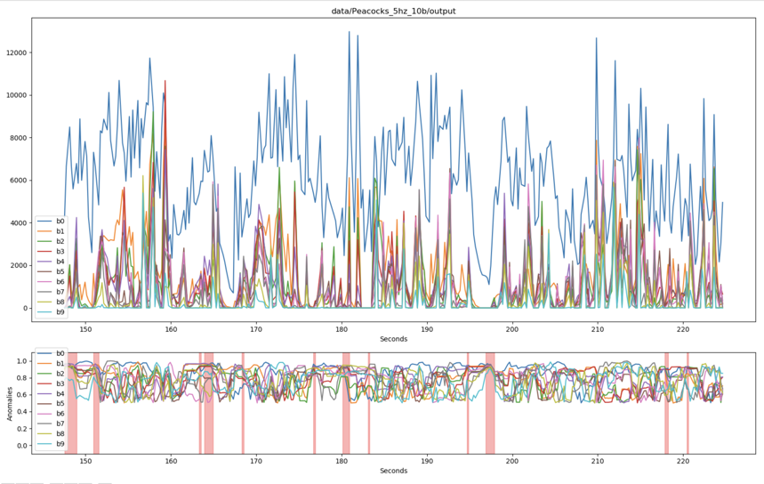

## Requirements

- [NuPIC](https://github.com/numenta/nupic)
- [matplotlib](http://matplotlib.org/)
- [numpy](http://www.numpy.org/)

Get anomalies from audio input in 3 easy steps!

### 1. Generate NuPIC Input From WAV

    ./convert_wav.py <path/to/wav>

There are several options for this, which you can see with the `--help` flag. You can control the FFT histogram sample rate, the number of histogram buckets, and the output directory where the file is written.

The resulting folder contains files formatted for NuPIC model input.

#### Options

- `--buckets,-b`: _[default 10]_ Number of frequency buckets to split the input when applying the FFT.
- `--sample-rate,-s`: _[default 5]_ How many samples to take per second.
- `--output_directory,-o`: _[default "output"]_ Directory to write the NuPIC input files.
- `--verbose,-v`: _[default `False`]_ Print debugging statements.
- `--loop,-l`: _[default 1]_ How many times to loop the WAV file (for reinforcing a pattern in NuPIC while training).
- `--plot,-p`: _[default `False`]_ Plot WAV spectrogram in matplotlib instead of writing NuPIC input files.

### 2. Run NuPIC

    ./run.py <path/to/input/directory> [options]
    
Runs all the prepared data in the input directory. Expects this directory to have been created by the `convert_wav.py` script above.

- `--model_params,-m`: _[default "grok_anomaly"]_ Name of the model params to use (without the '_model_params.py'). You won't need to set this unless you really know what you are doing.
- `--plot,-p`: _[default `False`]_ Plots the output instead of writing to file.
- `--verbose,-v`: _[default `False`]_ Print debugging statements.
- `--save,-s`: _[default `False`]_ Will checkpoint the model after running so it can be reused later.
- `--resurrect,-r`: _[default `False`]_ Uses specified model checkpoint instead of creating a new model using the model parameters. Learning will be automatically disabled on this model.

### 3. Plot the Results

    ./plotter.py <path/to/nupic/output/directory> [options]
    
Plots the results. Use `--wav` to pass in a WAV file to play at the same time.  There are several options for this, which you can see with the `--help` flag. 

- `--wav,-w`: _[default `None`]_ Path to a WAV file to play synced to the plot.
- `--maximize,-m`: _[default `False`]_ Maximize plot window.
- `--use_anomaly_score,-a`: _[default `False`]_ Use the anomalyScore from NuPIC instead of the anomalyLikelihood.
- `--anomaly_threshold,-t`: _[default 0.9]_ Value the anomaly likelihood(s) must breach before being marked as anomalous in the chart.
- `--anomaly_trigger,-g`: _[default 1]_ How many bins must be above the anomaly threshold to display an anomaly on the chart.

As an example, if you would like to flag a region as anomalous if the NuPIC anomaly likelihoods for 5 frequency bins are above `0.8`, you would use the following options:

    ./plotter.py path/to/nupic/output -t 0.8 -g 5
    
To reproduce my demo you would use:

    ./convert_wave.py data/Peacocks.wav
    ./run.py data/Peacocks_5hz_10b/input
    ./plotter.py data/Peacocks_5hz_10b/output --wav data/Peacocks.wav --anomaly_trigger 4
    
## Music License  
The music used in this demo is:  

Song: [The Peacocks](https://www.youtube.com/watch?v=j6YUS5X45e4)  
Artist: Esperanza Spalding  
Album: Junjo  
Licensed to YouTube by: The Orchard Music (on behalf of Ayva Musica Producciones); LatinAutor, BMG Rights Management, CMRRA, UBEM, and 4 Music Rights Societies  

## [Original Demo](https://www.youtube.com/watch?v=rNbntHRdEmM)

[  
Note that this Demo uses a version of the software that incorrectly extracted the frequencies. However it is still useful to understand how to use the software.

## Notes

Could be applicable to this [heart sound challenge](http://www.peterjbentley.com/heartchallenge/).
